# 🗂️ Opus Prototype v0 — Component Tree

> **Generated**: 2026-04-25  
> **Version**: Post-Refactor (RF-01 ~ RF-09 applied)  
> **Source files**: `index.html` · `app.js` · `styles.css`

---

## Component Tree (Mermaid)

```mermaid
graph TD
    APP["🖥️ App (index.html + app.js)"]

    APP --> LOGIN["📺 Screen: Login\n#screen-login"]
    APP --> DASH["📺 Screen: Dashboard\n#screen-dashboard"]
    APP --> MODAL_DETAIL["🪟 Modal: 검증 상세\n#detail-modal"]
    APP --> MODAL_NOTI["🪟 Modal: 알림 발송\n#noti-modal"]
    APP --> MODAL_SITE["🪟 Modal: 사이트 설정\n#site-modal"]
    APP --> TOAST["🍞 Toast\n.toast (dynamic)"]

    %% LOGIN subtree
    LOGIN --> LOGIN_CARD["LoginCard\n.login-card"]
    LOGIN_CARD --> LOGO_A["Logo\n🛡️ HR BooleanAI"]
    LOGIN_CARD --> LOGIN_FORM["LoginForm\n#login-form"]
    LOGIN_FORM --> INPUT_EMAIL["Input: 이메일\n#login-email"]
    LOGIN_FORM --> INPUT_PW["Input: 비밀번호\n#login-password"]
    LOGIN_FORM --> ERROR_MSG["ErrorMsg\n#login-error"]
    LOGIN_FORM --> BTN_LOGIN["Button: 로그인\nbtn-primary"]

    %% DASHBOARD subtree
    DASH --> NAV["TopNav\n.top-nav"]
    DASH --> ACTION_BAR["ActionBar\n.action-bar"]
    DASH --> LAYOUT["MainLayout\n.main-layout"]

    NAV --> LOGO_B["Logo\n🛡️ HR BooleanAI"]
    NAV --> BTN_NOTI["Button: 알림 발송\nopenNotiModal()"]
    NAV --> NAV_USER["NavUser\n#nav-user-email / role"]
    NAV --> BTN_LOGOUT["Button: 로그아웃\nhandleLogout()"]

    ACTION_BAR --> SCAN_GROUP["ScanGroup\n.scan-group"]
    ACTION_BAR --> EXPORT_GROUP["ExportGroup"]
    SCAN_GROUP --> INPUT_FOLDER["Input: 폴더 경로\n#folder-path"]
    SCAN_GROUP --> BTN_SCAN["Button: 스캔\nhandleFolderScan()"]
    SCAN_GROUP --> SCAN_STATUS["ScanStatus\n#scan-status"]
    EXPORT_GROUP --> BTN_SITE["Button: 사이트 설정\nopenSiteSettings()"]
    EXPORT_GROUP --> BTN_EXCEL["Button: 엑셀 다운로드\nexportExcel()"]
    EXPORT_GROUP --> BTN_PDF["Button: PDF 다운로드\nexportPDF()"]

    LAYOUT --> SIDEBAR["Sidebar\n.sidebar"]
    LAYOUT --> MAIN_CONTENT["MainContent\n.main-content"]

    SIDEBAR --> FOLDER_TREE["FolderTree\n.tree-list (static HTML)"]
    SIDEBAR --> BTN_VERIFY["Button: 검증 시작\nshowToast()"]

    MAIN_CONTENT --> STATS_GRID["StatsGrid\n.stats-grid"]
    MAIN_CONTENT --> TABS["Tabs\n.tabs"]
    MAIN_CONTENT --> TABLE_WRAPPER["DataTable\n.table-wrapper"]

    STATS_GRID --> STAT_TOTAL["StatCard: 총 검증 서류\n.stat-card.total"]
    STATS_GRID --> STAT_DONE["StatCard: 검증 완료\n.stat-card.done"]
    STATS_GRID --> STAT_REVIEW["StatCard: 확인 필요\n.stat-card.review"]
    STATS_GRID --> STAT_MANUAL["StatCard: 수동 리뷰\n.stat-card.manual"]

    TABS --> TAB_ALL["Tab: 전체 보기\ndata-tab=all"]
    TABS --> TAB_FAIL["Tab: 확인 필요\ndata-tab=fail"]
    TABS --> TAB_MANUAL["Tab: 수동 리뷰\ndata-tab=manual"]

    TABLE_WRAPPER --> TABLE_ROW["TableRow × N\nrenderTable() JS 생성"]
    TABLE_ROW --> BTN_DETAIL["Button: 상세 보기\nopenDetailModal(id)"]

    %% MODAL: Detail
    MODAL_DETAIL --> CAPTURE_VIEWER["CaptureViewer\n#capture-viewer (JS 생성)"]
    MODAL_DETAIL --> COMPARE_TABLE["CompareTable\n#compare-tbody (JS 생성)"]
    MODAL_DETAIL --> AI_PANEL["AIPanel\n.ai-panel"]
    MODAL_DETAIL --> BTN_APPROVE["Button: 승인\nhandleApprove()"]
    MODAL_DETAIL --> BTN_REJECT["Button: 반려\nhandleReject()"]
    CAPTURE_VIEWER --> PANEL_ORIG["renderCapturePanel()\n원본 서류"]
    CAPTURE_VIEWER --> PANEL_RPA["renderCapturePanel()\nRPA 캡처"]

    %% MODAL: Notification
    MODAL_NOTI --> NOTI_LIST["NotiList\n#noti-list (JS 생성)"]
    MODAL_NOTI --> PREVIEW_BOX["PreviewBox\n.preview-box (static)"]
    MODAL_NOTI --> BTN_SEND["Button: 선택 발송\nhandleSendNotifications()"]

    %% MODAL: Site Settings
    MODAL_SITE --> SITE_ROWS["SiteRows × N\n#site-rows-container (SITES 배열 JS 생성)"]
    MODAL_SITE --> BTN_SAVE["Button: 저장\nsaveSiteSettings()"]

    %% Styling
    classDef screen fill:#e0e7ff,stroke:#4f46e5,color:#1e1b4b
    classDef modal fill:#fef9c3,stroke:#ca8a04,color:#422006
    classDef jsgen fill:#dcfce7,stroke:#16a34a,color:#14532d
    classDef button fill:#f1f5f9,stroke:#64748b,color:#0f172a
    classDef toast fill:#1e293b,stroke:#475569,color:#f8fafc

    class LOGIN,DASH screen
    class MODAL_DETAIL,MODAL_NOTI,MODAL_SITE modal
    class CAPTURE_VIEWER,PANEL_ORIG,PANEL_RPA,SITE_ROWS,TABLE_ROW,NOTI_LIST,COMPARE_TABLE jsgen
    class TOAST toast
```



---

## 범례

| 색상 | 의미 |
|------|------|
| 🟣 보라 | Screen 레이어 |
| 🟡 노랑 | Modal 레이어 |
| 🟢 초록 | JS 동적 렌더링 컴포넌트 |
| ⬛ 검정 | Toast (최상위 z-index) |

---

## 데이터 흐름 요약

```
MOCK_DATA (전역 상수)
    ├─▶ renderTable()          ← STATE.activeTab 필터
    ├─▶ openDetailModal(id)    ← id로 find()
    │       ├─ renderCapturePanel() × 2
    │       └─ buildCompareRows()
    └─▶ openNotiModal()        ← FAIL | MANUAL_REVIEW 필터

SITES (전역 상수)
    └─▶ openSiteSettings()     ← SITES.map() 렌더링

STATE
    ├─ currentScreen  → showScreen()
    ├─ loggedInUser   → handleLogin() / handleLogout()
    ├─ activeTab      → switchTab() → renderTable()
    └─ folderScanned  → handleFolderScan()
```
