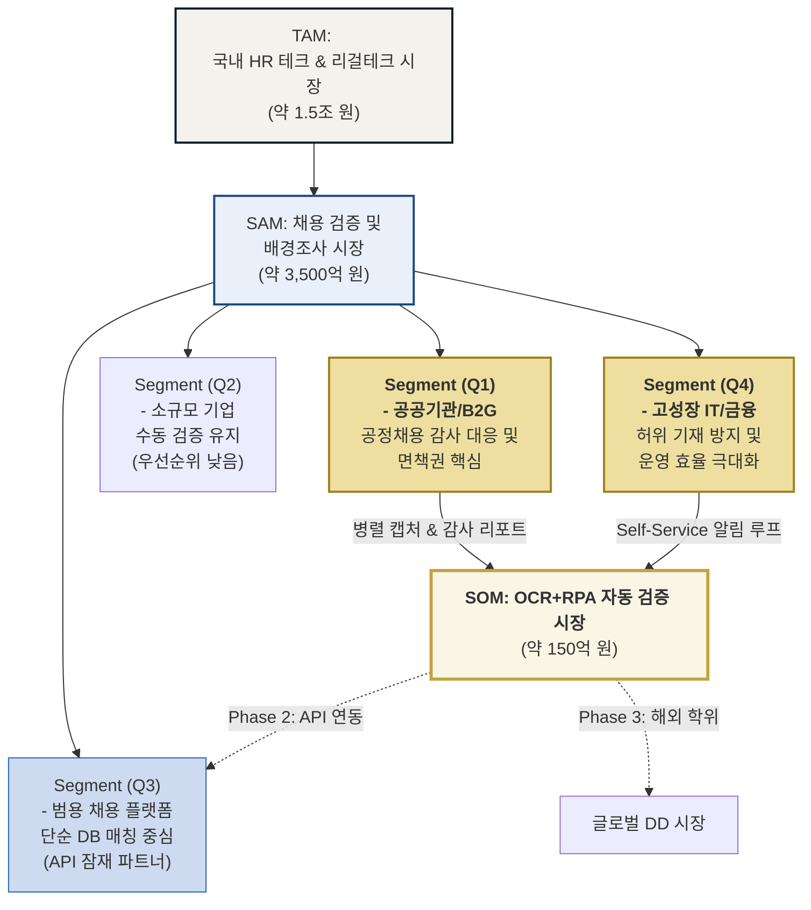

## 1. 시장 규모(TAM-SAM-SOM) 산출 로직 고도화

국내 HR 테크 시장의 성장세와 공공기관의 '공정 채용' 예산 구조를 바탕으로 산출한 시장 규모입니다.

### [표 1] 시장 규모 산출 근거 및 전환 로직

| **구분** | **시장 정의** | **규모(추정)** | **산출 로직 및 통계적 근거** |
| --- | --- | --- | --- |
| **TAM** | 국내 전체 HR 테크 및 리걸테크 시장 | **약 1.5조 원** | 채용, 급여, 노무 솔루션 전체를 포함한 시장 규모. 연평균 12% 이상의 성장률 반영. |
| **SAM** | B2B/B2G 채용 검증 및 배경조사 솔루션 시장 | **약 3,500억 원** | 공공기관 공정채용 감사 대응 및 민간 기업의 경력 검증 수요가 집중된 영역. |
| **SOM** | **OCR+RPA 통합 자동 검증 시장 (1년 차)** | **약 150억 원** | 감사 리스크가 큰 공공기관 및 고성장 스타트업을 타겟으로 한 초기 점유 목표. |

**[산출 로직 고도화]**

- **인건비 대체 모델 (Pocket Share):** 4,000명 규모의 공채 시 발생하는 약 **900~1,000만 원**의 수기 검증 인건비를 **450만 원** 수준의 솔루션 용역비로 전환시키는 전략입니다.
- **예산 항목의 유연성:** "소프트웨어 구매"가 아닌 **"서류검증 대행 용역"**으로 프레이밍하여, 신규 결재 없이 기존 인력 운영비 항목에서 즉시 집행 가능하도록 설계되었습니다.
- **확장성:** 초기 공공기관 중심의 용역 모델에서 단계별로 금융권 및 플랫폼 API 연동형(Enterprise)으로 확장하여 ARR(연간 반복 매출)을 극대화합니다.

---

## 2. Market Segment Map (Mermaid 시각화)

귀하께서 수정해주신 세그먼트 맵을 바탕으로, 초기 SOM 점유 이후의 단계별 확장 경로를 시각화했습니다.

### 2-1. 시장 구조 및 침투 경로

코드 스니펫

### 2-2. 마켓 포지셔닝 맵 (Quadrant Chart)

https://codepen.io/wrqwrlgw-the-lessful/pen/ogzaVmd

https://codepen.io/wrqwrlgw-the-lessful/pen/ogzaVmd

---

## 3. 세그먼트 심화 분석 및 전략

### Q1: 공공기관/B2G (우선순위 1위)

- **Pain-Point:** 합격자 발표 후 서류 위조 발견 시 담당자 징계 및 국정감사 리스크.
- **솔루션 가치:** "알바가 눈으로 봤다"는 주관적 검증이 아닌, **시스템이 생성한 캡처본** 기반의 객관적 증빙 리포트 제공.
- **전략:** 감사원 제출용 리포트 포맷을 내장하여 **'면책권'**을 구매하게 함.

### Q4: 고성장 IT/스타트업/금융 (우선순위 2위)

- **Pain-Point:** 잦은 이직과 대규모 채용 속에서 발생하는 서류 검증 병목 및 노무 리스크.
- **솔루션 가치:** **Self-Service 루프**를 통해 불일치 서류 발견 시 지원자에게 자동 알림톡을 발송하여 재제출을 유도, 인사 담당자의 민원 전화를 90% 차단.
- **전략:** 투자사(VC)의 DD(기업실사) 팀을 공략하여 학위/경력 검증의 무결성 확보.

---

## 4. 기술적 차별성 및 ROI 분석

### 4-1. '법적 증빙력' 관점의 대조

| **항목** | **단순 OCR 솔루션** | **본 솔루션 (OCR+RPA)** |
| --- | --- | --- |
| **검증 방식** | 텍스트 추출 후 DB 비교 | **기관 사이트 실시간 조회 및 화면 캡처** |
| **증빙 자료** | 텍스트 데이터 (위변조 가능성 제기) | **원본/조회본 병렬 캡처 이미지 (법적 증거)** |
| **감사 대응** | 담당자가 별도 리포트 작성 | **감사원 제출용 PDF 자동 생성** |

### 4-2. 인건비 절감 및 ROI 산출 (4,000건 프로젝트 기준)

- **도입 전:** 알바 15명 × 2주 = **약 900~1,000만 원** 지출.
- **도입 후:** 솔루션 배치 처리(4분) = **약 450~500만 원** (인건비 50% 절감).
- **정성적 ROI:** 서류 오인식으로 인한 합격자 정정(재공고 비용 수억 원 및 기관 신뢰도 추락) 리스크 원천 차단.

---

## 5. 법규 준수 및 리스크 관리

- **개인정보보호법:** OCR 신뢰도 임계값 미달 시에만 수동 확인 큐로 넘겨 정보 노출 최소화.
- **채용절차법:** 공정 채용 지침에 따른 객관적 검증 프로세스 구축으로 채용 과정의 투명성 확보.
- **시스템 안정성:** 기관 사이트 구조 변경에 대응하기 위해 **RPA 모니터링 알림** 및 72시간 내 대응 SLA를 보장함.

본 솔루션은 단순한 기술적 도구를 넘어, 채용의 공정성을 시스템적으로 담보하고 담당자의 행정적 부담을 획기적으로 낮추는 **'HR 리스크 관리 표준'**으로 자리매김할 것입니다.