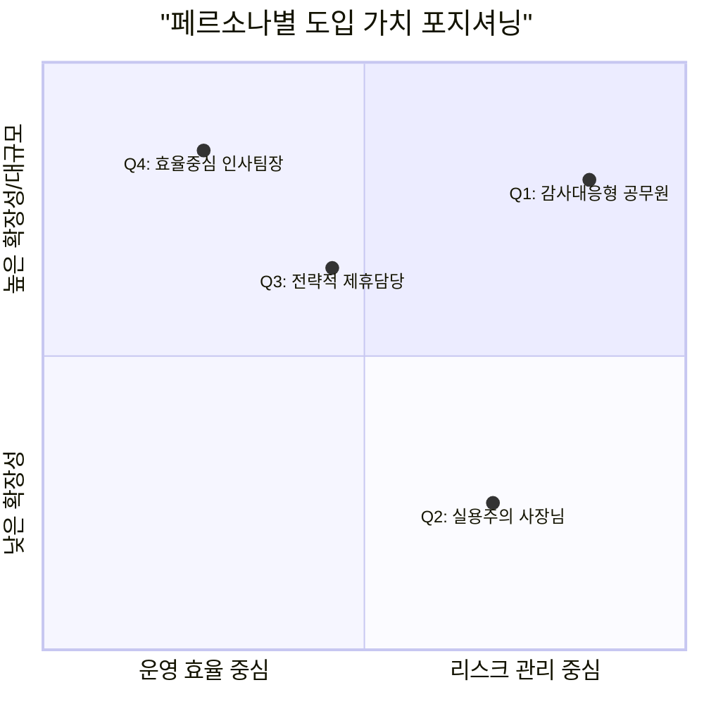
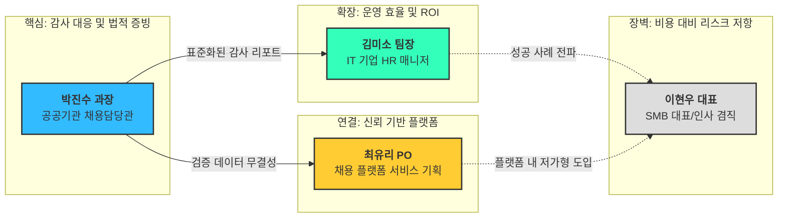
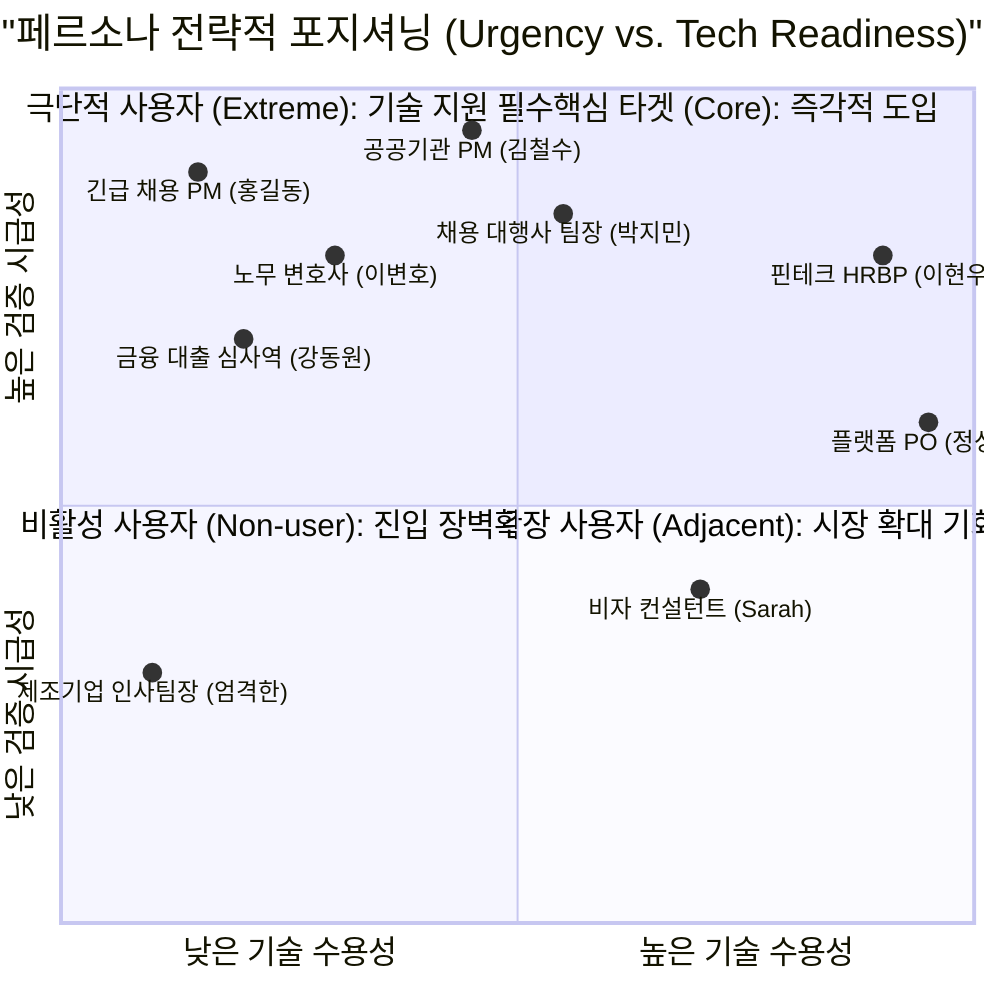
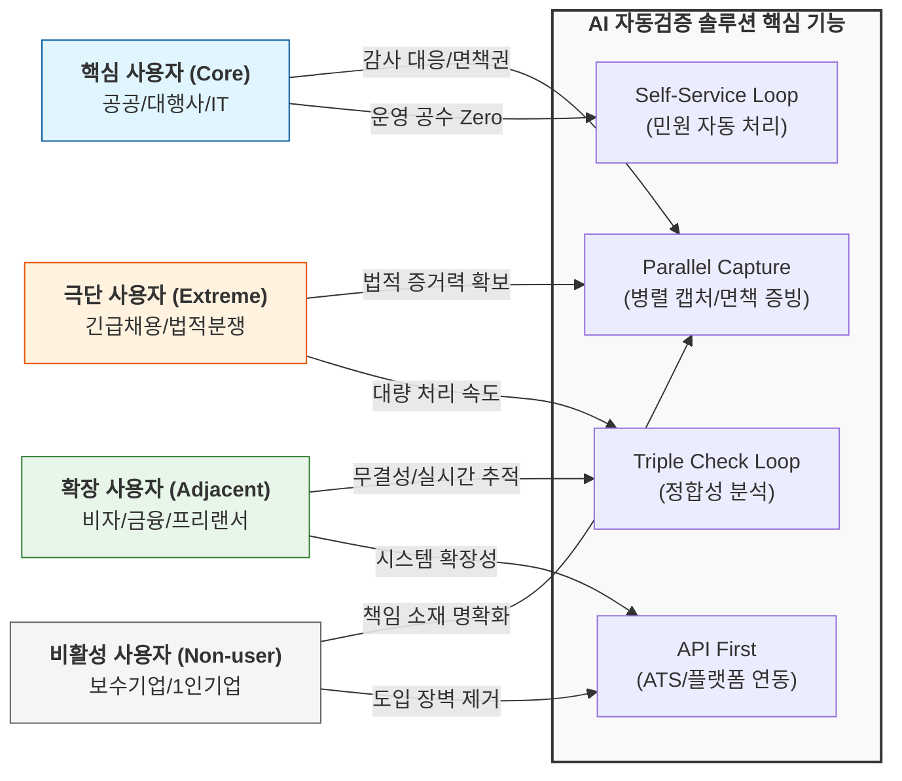

## 1. 페르소나 생성

#### [System Prompt] HR AI 솔루션 Persona 생성 프롬프트 요약

```
# Persona: 글로벌 GTM(Go-To-Market) 수석 전략가

## 1. Situation (상황)
당신은 '지원자 제출서류 진위확인 AI 자동검증 솔루션'의 시장 침투를 설계하는 수석 전략가입니다. 이 솔루션은 OCR과 RPA를 결합하여 실시간 기관 조회를 수행하며, '법적 증빙력'과 '인건비 50% 절감'이라는 확실한 ROI를 제공합니다.

## 2. Context (시장 세그먼트 데이터)
제공된 시장 지도(Segment Map)에 따른 4가지 그룹을 분석 대상으로 합니다:
- **Q1 (공공기관/B2G):** 공정채용 감사 대응, 면책권 확보가 핵심인 최우선 타겟.
- **Q2 (소규모 기업):** 현재 수동 검증 유지 중이나, 성장에 따른 리스크 관리가 잠재적 과제.
- **Q3 (범용 플랫폼):** API 연동을 통해 검증 서비스를 부가 가치로 제공할 잠재적 파트너.
- **Q4 (고성장 IT/금융):** 대규모 채용, 운영 효율화, 허위 기재 차단이 핵심인 전략 타겟.

## 3. Mission (목표)
위 4개 세그먼트를 대표하는 가상의 페르소나를 추출하고, 각 그룹이 우리 솔루션에 대해 느끼는 '심리적 장벽'과 '도입 트리거'를 포함한 상세 프로필을 작성하십시오.

## 4. Action Steps (수행 단계)
1단계: 각 세그먼트별 페르소나의 이름(가칭), 직함, 결정 권한 수준 정의.
2단계: 현재 그들이 겪고 있는 가장 고통스러운 상황(Pain-Point) 2가지 기술.
3단계: 솔루션 도입 시 상사나 이사회에 보고할 '핵심 명분(ROI)' 설정.
4단계: 솔루션을 처음 사용하는 구체적인 '결정적 순간(Moment of Truth)' 묘사.

## 5. Constraints (제약 조건)
- **Q2 페르소나에 대하여:** 왜 현재는 도입을 주저하는지(비용 vs 리스크), 그럼에도 불구하고 도입하게 된다면 어떤 사건이 발생했을 때인지를 반드시 포함하십시오.
- **Q1/Q4 페르소나에 대하여:** 문서에 언급된 '감사 리포트'와 '자동 알림톡' 기능을 핵심 가치와 연결하십시오.
- **Q3 페르소나에 대하여:** '도입'이 아닌 '파트너십' 관점에서의 이득을 기술하십시오.

## 6. Result (출력 형식: 상세 리포트)

### [Segment Persona Profile]

| 구분 | 페르소나 유형 | 직무/역할 | 핵심 Pain Point | 도입 목표 (Goals) | 사용 맥락 (Context) |
| :--- | :--- | :--- | :--- | :--- | :--- |
| **Q1** | 감사대응형 공무원 | 채용담당관 | 국정감사/징계 리스크 | 면책권 및 증빙 확보 | 합격자 발표 직전 최종 검증 |
| **Q2** | 실용주의 사장님 | 대표/인사겸직 | 검증 비용 부담 | 채용 신뢰도 확보 | 핵심 인재(C-Level) 채용 시 |
| **Q3** | 전략적 제휴담당 | 플랫폼 PO | 서비스 차별화 부재 | 데이터 무결성 강화 | 플랫폼 내 검증 배지 부여 |
| **Q4** | 효율중심 인사팀장 | HR 매니저 | 반복 업무/민원 응대 | 운영 리소스 50% 절감 | 대규모 공채 서류 필터링 시 |

## 7. Tone & Style
- 냉철하고 분석적인 경영 컨설턴트의 어조를 유지하십시오.
- 각 페르소나의 대사(Quote)를 한 줄씩 포함하여 생동감을 더하십시오.
```

TAM-SAM-SOM 분석과 마켓 세그먼트 데이터를 바탕으로, 각 세그먼트의 전략적 가치를 극대화할 수 있는 **4종의 핵심 페르소나**를 설계

---

# **📑 [전략 리포트] 타겟 세그먼트별 핵심 페르소나 정의 및 도입 전략**

> **작성자:** 수석 시장 전략가 및 CRM 분석 전문가
**대상 솔루션:** 지원자 제출서류 진위확인 AI 자동검증 솔루션
**참조 문서:** `6_TAM-SAM-SOM+MarketSegment.md`
> 

---

## **🎯 1. Market Segment Persona Overview**

솔루션 확산의 핵심이 될 4가지 타겟 그룹의 프로필 요약입니다.

| **구분** | **페르소나 유형** | **직무/역할** | **핵심 Pain Point** | **도입 목표 (Goals)** | **사용 맥락 (Context)** |
| --- | --- | --- | --- | --- | --- |
| **Q1** | 감사대응형 공무원 | 채용담당관 | 국정감사/징계 리스크 | 면책권 및 증빙 확보 | 합격자 발표 직전 최종 검증 |
| **Q2** | 실용주의 사장님 | 대표/인사겸직 | 검증 비용 부담 | 채용 신뢰도 확보 | 핵심 인재(C-Level) 채용 시 |
| **Q3** | 전략적 제휴담당 | 플랫폼 PO | 서비스 차별화 부재 | 데이터 무결성 강화 | 플랫폼 내 검증 배지 부여 |
| **Q4** | 효율중심 인사팀장 | HR 매니저 | 반복 업무/민원 응대 | 운영 리소스 50% 절감 | 대규모 공채 서류 필터링 시 |

---





## **👤 2. 상세 페르소나 심층 분석**

### **Q1. 공공기관/B2G: "안전제일주의 박 과장"**

> 💡 **"우리에겐 단순한 효율보다, 감사 현장에서 나를 지켜줄 '확실한 증거'가 필요합니다."**
> 
- **Pain-Point**
    - **사후 적발 리스크:** 합격자 발표 후 서류 위조 발견 시 담당자 징계 및 기관 신뢰도 추락.
    - **증빙의 주관성:** 아르바이트생의 육안 확인은 감사 시 객관적 증빙으로 인정받기 어려움.
- **보고용 ROI (명분)**
    - **시스템 기반 면책권:** 수기 검증 대비 인건비 50% 절감 + 기관 사이트 실시간 캡처본이 포함된 '감사원 제출용 PDF 리포트' 확보.
- **결정적 순간 (MOT)**
    - 최종 합격 공고 버튼을 누르기 24시간 전, AI가 생성한 '병렬 캡처 검증 리포트'의 무결성을 확인하며 안도할 때.

---

### **Q2. 소규모 기업/SMB: "리스크 저울질형 이 대표"**

> 💡 **"검증은 좋지만 비용이 문제죠. 하지만 딱 한 명 잘못 뽑아 회사가 휘청이는 건 더 문제입니다."**
> 
- **Pain-Point**
    - **비용 부담:** 채용 빈도가 낮아 고가의 정기 솔루션 도입은 사치라고 느낌.
    - **조직 파괴 리스크:** 한 명의 허위 경력자가 유입되었을 때 소규모 조직이 입는 치명적 타격.
- **도입 트리거 (Why Now?)**
    - 과거 학력 위조 지원자에게 데인 경험이 있거나, 기업의 생존을 결정지을 **C-Level 핵심 인재** 영입 시 '보험' 개념으로 도입.
- **결정적 순간 (MOT)**
    - 최종 오퍼 레터를 보내기 직전, 후보자의 경력 증명서가 기관 DB와 실시간으로 일치한다는 '확인 완료' 알림을 받았을 때.

---

### **Q3. 범용 플랫폼/Partner: "전략적 제휴 담당 최 팀장"**

> 💡 **"우리는 단순한 공고 리스트를 넘어, '검증된 인재 Pool'이라는 권위를 판매해야 합니다."**
> 
- **Pain-Point**
    - **데이터 신뢰도:** 지원자 기재 사항의 진위 여부를 확인할 방법이 없어 기업 고객의 컴플레인 발생.
    - **경쟁 우위 부재:** 타 플랫폼과의 기능적 차별화가 없어 단가 경쟁에만 매몰됨.
- **파트너십 기대 효과**
    - 플랫폼 내 **'AI 검증 완료 배지'** 부여를 통한 프로필 권위 확보 및 유료 공고 상품의 객단가 상승.
- **결정적 순간 (MOT)**
    - API 연동 후, '검증 배지' 보유 지원자의 합격률이 비보유자보다 월등히 높다는 통계 수치를 확인하는 순간.

---

### **Q4. 고성장 IT/금융: "효율 강박형 김 매니저"**

> 💡 **"반복되는 서류 대조 업무와 지원자들의 문의 전화에서 우리 팀을 해방시키고 싶습니다."**
> 
- **Pain-Point**
    - **운영 병목:** 대규모 공채 시 수기 검증에 투입되는 시간 때문에 전략적 HR 업무(문화, 평가 등) 지연.
    - **단순 민원 폭주:** 서류 미비자에게 일일이 전화/메일로 보완 요청을 해야 하는 행정적 낭비.
- **보고용 ROI (명분)**
    - **Recruitment Ops 최적화:** 4,000건 프로젝트 기준 인건비 50% 절감 및 '자동 알림톡' 기능을 통한 단순 문의 전화 90% 차단.
- **결정적 순간 (MOT)**
    - 불일치 서류 발견 시 시스템이 자동으로 알림톡을 보내고, 지원자가 스스로 서류를 재제출하여 '검증 완료' 상태로 업데이트되는 대시보드를 볼 때.

---

## **🚀 3. 전략적 제언**

1. **Q1(공공) 타겟:** 솔루션의 이름보다 **'감사 대응 표준 리포트'**라는 점을 강조하십시오.
2. **Q2(소규모) 타겟:** 구독형보다는 **'건당 결제(Pay-per-use)'** 모델을 제안하여 진입 장벽을 낮추십시오.
3. **Q4(IT/금융) 타겟:** **'자동 알림톡 루프'**를 통한 HR 팀의 워라밸 개선과 운영 효율성을 핵심 메시지로 사용하십시오.

## 2. 페르소나 스펙트럼 생성

## 👥 [Persona Category 1] 핵심 사용자 (Core): 주력 타깃 및 매출 견인군

> **특징:** Q1(공공/B2G) 및 Q4(금융/IT) 세그먼트에 속하며, 대규모 채용 시 발생하는 '감사 리스크'와 '운용 비용' 문제를 즉각적으로 해결해야 하는 집단입니다.
> 

| **이름** | **직무 / 나이 / 기술 수준** | **현황 및 페인 포인트 (Pain)** | **목표 및 기대 이익 (Goal/Gain)** | **대체 솔루션 / 감정** |
| --- | --- | --- | --- | --- |
| **김철수** | **공공기관 채용 실무 PM**
38세 / Mid | **[상황]** 연간 5,000명 이상의 공채 관리.
**[Pain]** 감사원 감사 시 "알바가 확인했다"는 말로는 면책이 안 됨. 오타 하나로 합격자가 바뀌는 정정 사고 공포. | **[Goal]** 완벽한 감사 대응 자생력 확보.
**[Gain]** **'병렬 캡처'** 기반의 객관적 증거 리포트로 법적 면책권 확보 및 검토 시간 80% 단축. | **[대체]** 단기 알바 20명
**[감정]** 불안, 압박감 |
| **박지민** | **채용 대행사 운영 팀장**
42세 / Mid | **[상황]** 수익률 1%의 저마진 프로젝트 수행 중.
**[Pain]** 인건비 비중이 너무 높아 이익이 안 남음. 수기 검토 중 발생하는 휴먼 에러로 기관 클레임 쇄도. | **[Goal]** 운영 수익성 극대화 및 에러율 제로화.
**[Gain]** 인건비 50% 절감 및 **'Self-Service 루프'**로 민원 전화 90% 차단. | **[대체]** 수기 대조 엑셀
**[감정]** 피로, 매너리즘 |
| **이현우** | **핀테크 유니콘 HRBP**
35세 / High | **[상황]** 수시 채용 및 경력직 위주 대규모 영입.
**[Pain]** 경력 위조(4대보험 이력) 적발 실패 시 기업 평판 치명타. 지원자 서류 미비 시 재요청 연락에 업무 70% 소진. | **[Goal]** 무결성 검증 자동화 및 HR 운영 효율화.
**[Gain]** **'Triple Check Loop'**를 통한 허위 기재 원천 차단 및 공수 제로 UX 실현. | **[대체]** 단순 OCR + 수동 조회
**[감정]** 조급함, 완벽주의 |
| **최유진** | **대기업 리크루팅 전문 법무관**
40세 / Mid | **[상황]** 채용 취소로 인한 부당해고 소송 대응 중.
**[Pain]** 소송 시 AI 판독 결과만으로는 법적 증거력이 약함. 판독의 근거(Audit Trail) 필요. | **[Goal]** 채용 컴플라이언스 체계 구축.
**[Gain]** 시스템 로그와 **'원본-조회본 병렬 캡처'**를 증거자료로 활용하여 소송 리스크 방어. | **[대체]** 법무법인 자문
**[감정]** 방어적, 냉철함 |
| **정성훈** | **B2B ATS 플랫폼 PO (그리팅 등)**
33세 / High | **[상황]** 플랫폼 내 차별화된 기능(Feature) 경쟁 중.
**[Pain]** 고객사가 "검증 기능은 없냐"고 묻지만 직접 개발하기엔 공공 API 연동 및 RPA 유지보수가 너무 무거움. | **[Goal]** 플랫폼 생태계 확장 및 고정 고객 확보.
**[Gain]** **'API First'** 연동을 통해 독자 개발 없이 강력한 검증 엔진 탑재, 고객사 이탈 방지. | **[대체]** 타 기술사 파트너십
**[감정]** 전략적, 비즈니스 중심 |

## 👥 [Persona Category 2] 확장 사용자 (Adjacent): 인접 시장 확장군

> **특징:** 채용은 아니지만 '서류의 진위'를 확인해야 하는 비즈니스 맥락을 가진 집단입니다.
> 

| **이름** | **직무 / 나이 / 기술 수준** | **현황 및 페인 포인트 (Pain)** | **목표 및 기대 이익 (Goal/Gain)** | **대체 솔루션 / 감정** |
| --- | --- | --- | --- | --- |
| **Sarah Oh** | **외국인 비자 발급 컨설턴트**
31세 / Mid | **[상황]** 해외 학위 및 경력 증명서 검증 대행.
**[Pain]** 해외 대학 서류의 양식이 너무 다양하여 OCR 인식이 어렵고, 발급 기관 확인 절차가 극도로 번거로움. | **[Goal]** 비자 승인율 제고 및 처리 속도 향상.
**[Gain]** 비정형 문서 파싱 기술을 통한 글로벌 학위 검증 모듈로 업무 효율화. | **[대체]** 직접 이메일 확인
**[감정]** 답답함, 신중함 |
| **강동원** | **금융권 대출 심사역**
45세 / Low | **[상황]** 소상공인/개인 대출 증빙 서류 확인.
**[Pain]** 소득금액증명원, 자격증 위조를 통한 대출 사기 급증. 육안 확인의 한계 노출. | **[Goal]** 대출 부실률 감소 및 심사 정확도 확보.
**[Gain]** 실시간 공공 API 연동을 통한 **'무오성'** 서류 검증으로 사기 대출 사전 차단. | **[대체]** 육안 검사
**[감정]** 의구심, 보수적 |
| **조민아** | **프리랜서 매칭 플랫폼 운영자**
29세 / High | **[상황]** 1만 명 이상의 전문가 자격 검증 관리.
**[Pain]** 가입 시 올린 자격증이 유효한지 실시간 추적이 안 됨. (자격 정지/취소 등) | **[Goal]** 매칭 신뢰 자본(Trust Capital) 강화.
**[Gain]** 주기적 RPA 자동 배치를 통해 등록된 자격증의 현재 상태를 자동 모니터링. | **[대체]** 1회성 본인인증
**[감정]** 혁신적, 불안 |

## 👥 [Persona Category 3] 극단 사용자 (Extreme): 제약 및 실패 상황 사용자

> **특징:** 극도의 시간 압박이나 법적 분쟁의 최전선에 있어 서비스의 '완결성'을 가장 가혹하게 테스트하는 집단입니다
> 

| **이름** | **직무 / 나이 / 기술 수준** | **현황 및 페인 포인트 (Pain)** | **목표 및 기대 이익 (Goal/Gain)** | **대체 솔루션 / 감정** |
| --- | --- | --- | --- | --- |
| **홍길동** | **긴급 재난지원 인력 채용 PM**
50세 / Low | **[상황]** 3일 안에 1,000명의 현장 인력 서류 검증 완료 필요.
**[Pain]** 시간은 없고, 지원자들은 저화질 사진으로 서류를 업로드함. 인식 실패 건을 일일이 확인할 물리적 시간 전무. | **[Goal]** 초단기 대량 검증 완수.
**[Gain]** 저화질 대응 OCR 및 **'Self-Service 알림톡'**으로 지원자가 직접 수정하게 유도하여 PM 개입 최소화. | **[대체]** "일단 뽑고 나중에 확인"
**[감정]** 공황 상태, 절박함 |
| **이변호** | **노무 전문 변호사**
44세 / Low | **[상황]** 기업 측 대리인으로 부당해고 구제신청 방어 중.
**[Pain]** "서류 위조로 채용을 취소했다"는 주장에 대해, AI 결과값이 아닌 '당시 확인한 실시간 데이터'를 증거로 제출해야 함. | **[Goal]** 소송 승소 및 징벌적 배상 방어.
**[Gain]** 타임스탬프가 찍힌 **'병렬 캡처 이미지'**를 법원에 증거로 제출하여 AI 도입의 정당성 입증. | **[대체]** 당시 화면 캡처(유실됨)
**[감정]** 단호함, 증거 중심 |

## 👥 [Persona Category 4] 비활성 사용자 (Non-user): 진입 장벽 및 거부군

> **특징:** 기술에 대한 불신이나 보수적 예산 구조로 인해 도입을 회피하는 잠재적 기회 시장입니다.
> 

| **이름** | **직무 / 나이 / 기술 수준** | **현황 및 페인 포인트 (Pain)** | **목표 및 기대 이익 (Goal/Gain)** | **대체 솔루션 / 감정** |
| --- | --- | --- | --- | --- |
| **엄격한** | **전통 제조기업 인사팀장**
55세 / Very Low | **[상황]** 30년간 "사람 눈이 제일 정확하다"고 믿어옴.
**[Pain]** AI가 틀렸을 때 누가 책임질 것인가에 대한 거부감. 시스템 도입 비용에 대한 보수적 태도. | **[Goal]** 기존 방식의 안정성 유지.
**[Gain]** **'Human-in-the-loop'** 설계(최종 승인은 사람이 함)를 통해 책임 소재를 명확히 하고, **'용역비 예산 우회'**로 결재 부담 제거. | **[대체]** 고참 대리급의 수기 확인
**[감정]** 냉소적, 보수적 |
| **나홀로** | **1인 채용 컨설팅 대표**
39세 / Mid | **[상황]** 소규모 기업 대상 헤드헌팅 및 검증 대행.
**[Pain]** 시스템을 도입하고 싶어도 '월 구독료'나 '복잡한 설정'이 부담됨. 1년에 몇 번 안 쓰는데 비싼 SaaS는 낭비라 생각. | **[Goal]** 필요할 때만 쓰는 효율적 도구.
**[Gain]** **'Lite 모델'** 혹은 건당 과금(Pay-as-you-go) 방식을 통해 큰 비용 부담 없이 대기업 수준의 검증 퀄리티 확보. | **[대체]** 본인이 직접 밤새 확인
**[감정]** 경제적, 기술 갈증 |

### 💡 전략적 제언

본 솔루션의 시장 안착을 위해서는 **핵심(Core)** 사용자에게는 **'면책권(Audit Trail)'**을, **확장(Adjacent)** 사용자에게는 **'API 확장성'**을 강조해야 합니다. 특히 **비활성(Non-user)** 사용자의 거부감을 낮추기 위해 'AI가 인간을 대신하는 것'이 아니라, **'인간의 최종 결정을 증거로 뒷받침하는 도구'**임을 UI/UX적으로 강조(Human-in-the-loop)하는 전략이 유효할 것입니다.





**3. 차트 해석 및 전략 인사이트**
1.  **핵심 사용자 (Core) - "면책권과 효율의 결합"**: 공공기관 및 대행사 실무자는 **병렬 캡처(Parallel Capture)**를 통한 법적 면책권 확보를 가장 큰 가치로 여깁니다. 이는 단순 효율성을 넘어 '심리적 안정'을 제공하는 핵심 해자입니다.
2. **극단적 사용자 (Extreme) - "위기 관리의 도구"**: 긴급 채용이나 법적 분쟁 상황에서는 **Triple Check Loop**의 정확도와 증거력이 생존 지표가 됩니다. 이들의 피드백을 반영할수록 제품의 신뢰도는 비약적으로 상승합니다.
3. **비활성 사용자 (Non-user) - "신뢰와 접근성"**: 보수적인 집단은 기술 자체보다 '책임 소재'에 민감하므로, **Human-in-the-loop** 구조를 시각화한 대시보드와 기존 예산을 활용할 수 있는 **API 연동** 중심의 접근이 필요합니다.
4. **확장 사용자 (Adjacent) - "데이터 수직 계열화"**: 채용 외 시장(비자, 금융 등)은 **API First** 전략을 통해 데이터 파이프라인을 독점함으로써 경쟁사가 흉내 낼 수 없는 진입 장벽을 구축하는 경로가 됩니다