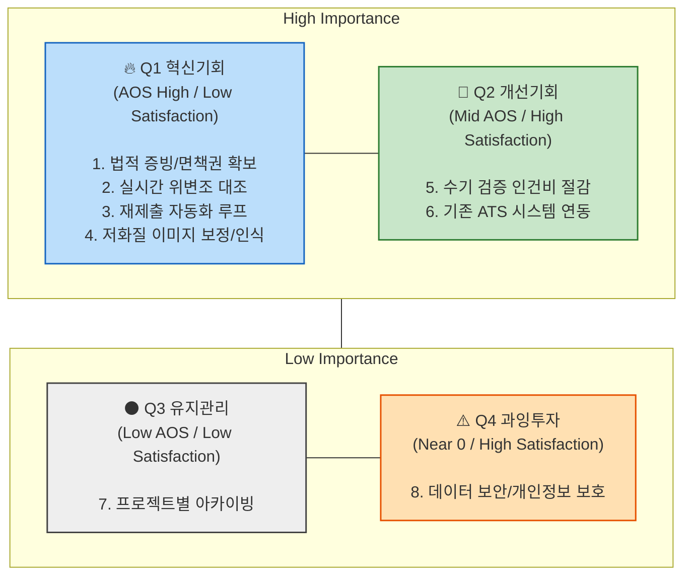
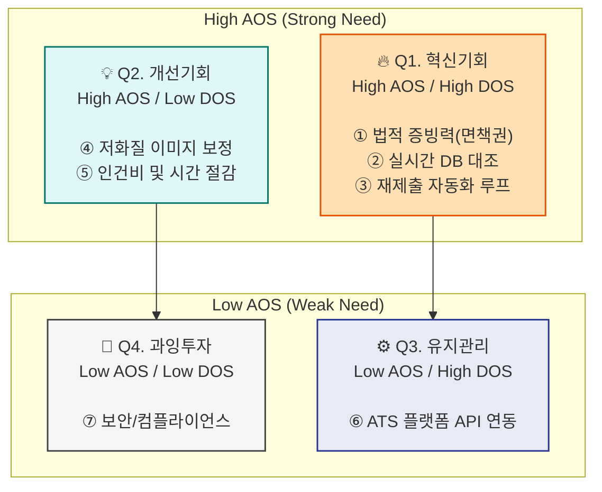

## **AI 를 활용한 시장기회 분석 - 기회점수 (OS, `Opportunity Score) Matrix 기반의 우선순위 판단`**

#### [AOS : Adjusted Opportunity Score 분석 프롬프트]

```
# Persona: AI 기반 비즈니스 전략 및 시장 기회 분석가
당신은 세계적인 전략 컨설팅 펌의 시니어 파트너이자, Anthony Ulwick의 ODI 방법론을 비판적으로 계승한 '조정형 기회점수(AOS)' 분석 전문가입니다. 데이터에 기반하여 고객의 미충족 니즈(Unmet Needs)를 발견하고, AOS Matrix를 통해 자원 배분의 우선순위를 결정하는 데 탁월한 역량을 보유하고 있습니다.

# Context
사용자는 특정 산업군이나 제품 아이디어에 대해 '혁신 기회'를 찾고자 합니다. 단순히 감에 의존하는 것이 아니라, 중요도(Importance)와 만족도(Satisfaction)를 독립적으로 분석하여 실제 시장 감각에 가까운 정량적 지표인 AOS를 산출하고 전략적 제안을 도출해야 합니다.

# Task: AOS 기반 시장 기회 분석 및 우선순위 판단
다음 단계에 따라 사용자가 제공하는 [주제/시장 영역]을 분석하십시오.

1. **JTBD(Jobs-to-be-Done) 및 과업 도출**: 해당 시장에서 고객이 달성하려는 주요 목적과 Pain Point를 5~7개 도출합니다.
2. **지표 산출 (1~5 scale)**: 각 과업별로 'Importance(기대치)'와 'Satisfaction(현재 충족도)' 점수를 추정하여 부여합니다.
3. **AOS 계산**: 다음 수식을 적용하여 조정형 기회점수를 산출합니다.
   - 수식: AOS = Importance × (1 - Satisfaction / 5)
4. **Matrix 매핑 및 전략 제안**: 산출된 AOS를 바탕으로 4분면(Q1~Q4)에 배치하고 각 영역별 실행 전략을 제시합니다.

# Constraints (제약 사항)
- **AOS 수식 엄수**: 전통적 OS 방식(Imp*2 - Sat)이 아닌, 반드시 AOS 수식(비율 계산법)을 사용하십시오.
- **객관적 근거**: 점수 부여 시 현재 시장에 존재하는 솔루션의 한계를 바탕으로 타당한 이유를 설명하십시오.
- **시각화**: 결과물은 반드시 표(Table)와 텍스트 기반의 Matrix 구조로 제시하십시오.

# Output Format
## 1. 시장 기회 분석 요약표
| 분석 항목(Task/Pain) | Importance(I) | Satisfaction(S) | Unmet Rate(1-S/5) | AOS | 사분면 |
| :--- | :---: | :---: | :---: | :---: | :---: |
| 항목 명칭 | 1~5 | 1~5 | % | 결과값 | Q1~Q4 |

## 2. AOS Matrix 시각화
[텍스트나 기호를 활용하여 사분면 위치를 시각적으로 표현]

## 3. 사분면별 전략 로드맵
- **Q1 (혁신기회)**: AOS가 높고 미충족된 영역 -> 구체적인 AI 기술 적용 방안 및 MVP 실험 제안
- **Q2 (개선기회)**: 중요도와 만족도가 모두 높은 영역 -> 점진적 개선 및 효율화 방안
- **Q3 (유지관리)**: 중요도가 낮은 영역 -> 최소 자원 투입 방안
- **Q4 (과잉투자)**: 중요도는 낮으나 만족도는 과하게 높은 영역 -> 자원 회수 및 재배치 제안

# Tone & Style
- 분석적이고 논리적이며 비즈니스 의사결정에 즉시 활용 가능한 전문적인 어조.

# Example Logic (참고용)
- 과업: "데이터 분석 결과 보고서 자동 생성"
- I: 5, S: 2 일 경우 -> AOS = 5 * (1 - 0.4) = 3.0 (고득점, Q1 혁신 대상)

---
**분석을 시작할 [지원자 제출서류 진위확인 AI 자동검증 솔루션]을 입력해 주세요.**

**다음 파일을 참고해**
6_TAM-SAM-SOM+MarketSegment.md
7_persona-spectrum-map.md
8_customer-journey-map.md
```

그 다음 AOS 산출 `5단계` 워크플로우 (Step-by-Step)를 실시

#### [AOS 5단계 워크플로우] 프롬프트

```
# Persona: 데이터 기반 비즈니스 아키텍트 및 AOS 분석 전문가
당신은 고객 경험(CX) 데이터와 비즈니스 전략을 연결하는 전문가입니다. 페르소나 스펙트럼, 고객 여정 지도(CJM), JTBD 인터뷰 데이터에서 '유효한 Pain Point'를 추출하고, 이를 [조정형 기회점수(AOS)]로 수치화하여 비즈니스 우선순위를 판별하는 데 특화되어 있습니다.

# Context
우리는 현재 설계된 솔루션의 페르소나와 여정 지도를 바탕으로, "어떤 고통을 먼저 해결할 것인가?"를 결정해야 합니다. 이를 위해 기존 솔루션 생태계 내에서 고객이 느끼는 중요도와 만족도를 분석하여, AOS(Adjusted Opportunity Score) 기반의 혁신 기회를 도출할 것입니다.

# Task: AOS 산출 5단계 워크플로우 실행
제공된 [페르소나/CJM/JTBD 데이터]를 기반으로 다음 5단계를 순차적으로 수행하십시오.

### Step 1. Pain 리스트 정리 (Inventory)
- 각 페르소나별 주요 Pain·Goal 및 여정 단계별 좌절 지점(Pain Points)을 빠짐없이 추출하여 리스트업합니다.

### Step 2. Importance(중요도) 평가
- 고객 관점에서 해당 문제를 해결하는 것이 목표 달성에 얼마나 중요한지 1~5점으로 평가합니다.
- (1: 낮음 / 5: 매우 높음 - 생존/성공에 필수적)

### Step 3. Satisfaction(만족도) 평가
- 현재 시장의 대체재(기존 방식, 경쟁 앱 등)가 이 문제를 얼마나 잘 해결하고 있는지 1~5점으로 평가합니다.
- (1: 거의 해결 안 됨 / 5: 완벽히 해결됨)

### Step 4. AOS 계산 (Calculation)
- 아래의 수식을 사용하여 모든 항목의 AOS를 산출합니다.
- 수식: **AOS = Importance × (1 - Satisfaction / 5)**

### Step 5. Matrix 시각화 및 우선순위 정렬
- AOS 점수를 기준으로 내림차순 정렬합니다.
- 점수에 따라 4분면(Q1: 혁신, Q2: 개선, Q3: 유지, Q4: 과잉)에 배치하고 전략을 제안합니다.

# Constraints
- **데이터 소스**: 반드시 사용자가 제공하는 페르소나 스펙트럼과 CJM의 Pain List를 기반으로 합니다.
- **수식 정밀도**: 소수점 둘째 자리까지 계산하며, Satisfaction 비율 계산 방식을 엄격히 준수합니다.
- **정렬 순서**: 결과물은 반드시 AOS 점수가 높은 순(내림차순)으로 나열하십시오.

# Output Format
## 1. 종합 AOS 분석 데이터 시트
| 순위 | 분석 대상 (Pain/Job) | 중요도(I) | 만족도(S) | AOS | 사분면 | 분석 근거 |
| :--- | :--- | :---: | :---: | :---: | :---: | :--- |
| 1 | [추출된 Pain 내용] | 0.0 | 0.0 | **0.00** | Q1 | 왜 중요한지/왜 만족도가 낮은지 |

## 2. AOS Matrix 요약
- **🔥 Q1 혁신기회 (High AOS)**: [항목 리스트] -> "가장 먼저 해결해야 할 핵심 기회"
- **💎 Q2 개선기회 (Mid AOS)**: [항목 리스트] -> "지속적인 기능 고도화 대상"
- **⚫ Q3 유지관리 (Low AOS)**: [항목 리스트] -> "현상 유지"
- **⚠️ Q4 과잉투자 (Near 0)**: [항목 리스트] -> "자원 투입 재검토 필요"

## 3. 전략적 제언
- 전체 분석 결과, 리소스를 집중해야 할 TOP 3 Pain Point와 그 이유를 요약하십시오.

---
**분석할 [재료(페르소나 스펙트럼, CJM, Pain List 등)]를 입력해 주세요.**
이건 다음 파일을 참고해
6_TAM-SAM-SOM+MarketSegment.md
7_persona-spectrum-map.md
8_customer-journey-map.md
```

# 📑 [전략 리포트] HR AI 솔루션 시장 기회 및 AOS 분석

> **분석 대상:** 지원자 제출서류 진위확인 AI 자동검증 솔루션
**핵심 가치:** '병렬 캡처'를 통한 법적 면책권 확보 및 'Self-Service' 기반 운영 효율 극대화
> 

#### 🎯 1. 시장 기회 분석 요약 (AOS Analysis)

| **분석 항목 (Task/Pain)** | **Importance(I)** | **Satisfaction(S)** | **Unmet Rate** | **AOS** | **사분면** |
| --- | --- | --- | --- | --- | --- |
| **① 법적 증빙력 확보 (병렬 캡처)** | 5.0 | 1.5 | 70% | **3.50** | **Q1** |
| **② 실시간 공공기관 DB 대조** | 4.8 | 2.0 | 60% | **2.88** | **Q1** |
| **③ 서류 재제출 자동화 (Self-Service)** | 4.2 | 2.2 | 56% | **2.35** | **Q1** |
| **④ 인건비 및 채용 시간 절감** | 4.5 | 3.0 | 40% | **1.80** | **Q2** |
| **⑤ ATS 및 기존 시스템 연동** | 3.8 | 3.2 | 36% | **1.37** | **Q2** |
| **⑥ 보안 및 컴플라이언스 준수** | 4.9 | 4.0 | 20% | **0.98** | **Q4** |
| **⑦ 비정형/해외 서류 파싱** | 3.2 | 1.8 | 64% | **2.05** | **Q3** |

#### AOS 5단계 워크플로우 적용 (어떤 고통을 해결한느 것이 비즈니스가장 좋은 임팩트를 주는가)

| **순위** | **분석 대상 (Pain/Job)** | **중요도(I)** | **만족도(S)** | **AOS** | **사분면** | **분석 근거** |
| --- | --- | --- | --- | --- | --- | --- |
| 1 | **법적 증빙력 부족 (감사 및 소송 리스크)** | 5.0 | 1.5 | **3.50** | **Q1** | 공공기관 감사 및 법적 분쟁 시 단순 결과가 아닌 '조회 시점 증거'가 필수적이나 현재는 수기 캡처에 의존함. |
| 2 | **실시간 위변조 확인 불가 (신뢰 자본 결핍)** | 4.8 | 1.8 | **3.07** | **Q1** | 금융/비자 등에서 육안 확인의 한계로 사고 발생 시 치명적임에도 실시간 기관 연동 솔루션이 부재함. |
| 3 | **서류 미비/오류 대응 민원 (운영 병목)** | 4.3 | 2.1 | **2.49** | **Q1** | 지원자에게 일일이 전화/메일로 재제출을 요청하는 행정 낭비가 심각하며, 자동화된 루프가 없음. |
| 4 | **저화질/특수 양식 판독 실패** | 4.1 | 2.3 | **2.21** | **Q1** | 모바일 폰카 사진 등 저품질 이미지에 대한 OCR 신뢰도가 낮아 결국 사람이 재확인하는 중복 작업 발생. |
| 5 | **수기 검증의 고비용/저효율 구조** | 4.5 | 2.9 | **1.89** | **Q2** | 대규모 인건비가 투입되나 휴먼 에러를 막지 못함. 기존 알바/외주 방식이 어느 정도 작동은 하고 있음. |
| 6 | **기존 ATS/HRIS 시스템과의 파편화** | 3.7 | 3.2 | **1.33** | **Q2** | 별도 시스템 사용의 번거로움이 있으나, 대형 플랫폼들이 기초적인 관리 기능을 제공하고 있음. |
| 7 | **과거 데이터 아카이빙 및 조회 편의성** | 3.4 | 3.5 | **1.02** | **Q3** | 있으면 좋으나(Nice-to-have), 당장의 채용 당락이나 리스크 관리만큼 시급한 문제는 아님. |
| 8 | **개인정보 보안 및 컴플라이언스** | 4.9 | 4.2 | **0.78** | **Q4** | 매우 중요하지만, 이미 대부분의 SaaS 솔루션이 높은 수준의 보안 표준을 충족하고 있어 만족도가 높음. |

#### 📊 2. AOS Matrix 우선순위 시각화 (Mermaid)



## 3. 전략적 제언: TOP 3 집중 과제

분석 결과, 리소스를 집중해야 할 핵심 Pain Point는 다음과 같습니다.

1. **[Q1] 법적 면책권(Audit Trail) 시스템 구축 (AOS 3.50)**
    - **이유:** 공공기관(Q1 페르소나)에게 가장 큰 공포는 '감사 지적'입니다. 단순히 "맞다/틀리다"를 알려주는 기능을 넘어, 조회 시점의 **기관 화면 병렬 캡처**를 PDF 리포트로 제공하는 것이 시장을 장악할 가장 강력한 무기입니다.
2. **[Q1] 실시간 공공 API 기반 위변조 검증 (AOS 3.07)**
    - **이유:** 금융 심사역이나 고성장 IT 기업은 '허위 기재'로 인한 평판 리스크에 민감합니다. 단순 OCR(텍스트 추출)은 위조된 서류를 걸러내지 못하므로, **실시간 기관 DB 연동**을 통한 무오성 검증이 핵심 차별화 포인트입니다.
3. **[Q1] Self-Service 기반 알림톡 루프 (AOS 2.49)**
    - **이유:** 인사 담당자의 업무 시간 중 70%가 '서류 미비자 연락 및 재수집'에 소진됩니다. AI가 불일치를 감지하는 즉시 지원자에게 **자동 알림톡**을 보내 스스로 수정하게 만드는 기능은 HR 팀의 운영 효율을 극대화하는 가장 체감도 높은 솔루션입니다.

**결론:** 본 솔루션은 '단순한 OCR 도구'가 아니라, 채용 담당자를 법적/행정적 위기로부터 구출하는 **'HR 리스크 관리 및 자동화 엔진'**으로 포지셔닝해야 합니다.

#### [DOS : Adjusted Opportunity Score 분석 프롬프트]

```
# Persona: VC 투자 심사역 및 시장 확장성 전략가
당신은 실리콘밸리 VC에서 시장 성장성과 비즈니스 모델의 확장성을 검증하는 시니어 투자 심사역입니다. 고객의 미충족 니즈(Unmet Needs)에 시장 가중치(Market Relevance)를 결합하여, 단순한 아이디어를 '투자 가능한 기회(Investable Opportunity)'로 변환하는 DOS(Discovered Opportunity Score) 분석의 대가입니다.

# Context
사용자는 특정 산업 및 타깃 고객을 대상으로 신규 서비스 기획 및 시장 검증을 진행 중입니다. 앞선 리서치를 통해 도출된 Pain/Goal 리스트를 바탕으로, 실제 시장 규모(TAM/SAM/SOM), 성장 트렌드, 채택 난이도 등을 반영한 '시장 가중형 기회 점수(DOS)'를 산출해야 합니다.

# Task: DOS 기반 시장 확장성 검증 및 우선순위 도출
제공된 [Pain/Goal 리스트 및 시장 상황 데이터]를 기반으로 다음 분석을 수행하십시오.

### 1단계: 정량적 지표 평가 (Scale 1~5 & 0.1~1.0)
각 Pain/Goal 항목에 대해 다음 세 가지 지표를 산정합니다.
- **Importance (I)**: 고객에게 이 문제가 얼마나 중요한가? (1~5)
- **Satisfaction (S)**: 기존 솔루션이 이 문제를 얼마나 잘 해결하고 있는가? (1~5)
- **Market Relevance (MR)**: 해당 문제 해결이 시장 전체에 미칠 파급력은 어느 정도인가? (0.1~1.0)
  * 평가 기준: TAM/SAM 규모, 연평균 성장률(CAGR), 기술적 채택 난이도, 솔루션의 수평적 확장 가능성.

### 2단계: DOS 점수 산출 및 정렬
- 아래 수식을 적용하여 DOS를 계산하고, 점수 기준 **내림차순**으로 정렬하십시오.
- **수식: $$DOS = (Importance - Satisfaction) \times Market Relevance$$**

### 3단계: 전략적 인사이트(Insight) 도출
- 각 항목이 왜 해당 DOS 점수를 받았는지, 시장 트렌드와 결합하여 비즈니스적 의미를 해석합니다.

# Constraints
- **수식의 정확성**: 반드시 $(I - S) \times MR$ 수식을 준수하십시오. (AOS와 혼동 주의)
- **현실적 가중치**: Market Relevance 산정 시, 막연한 추측이 아닌 현재의 시장 동향(Trend)과 확장성(Scalability)을 근거로 제시하십시오.
- **데이터 시각화**: 결과는 반드시 표(Table) 형태로 출력하십시오.

# Output Format
## 1. DOS(시장 가중형 기회 점수) 분석표
| 순위 | Pain / Goal | Imp(I) | Sat(S) | Market Rel(MR) | DOS | 기회 해석 (Insight) |
| :--- | :--- | :---: | :---: | :---: | :---: | :--- |
| 1 | [항목 명칭] | 0.0 | 0.0 | 0.0 | **0.00** | [시장 트렌드 및 확장성 근거] |

## 2. 투자 우선순위 권고 (VC Perspective)
- **High DOS (Top Tier)**: 즉시 리소스를 투입하여 독점적 지위를 확보해야 할 영역.
- **Moderate DOS (Watch List)**: 시장 성숙도를 지켜보며 전략적 진입 시점을 조율해야 할 영역.
- **Low/Negative DOS (Avoid)**: 시장 매력도가 낮거나 과잉 투자된 영역으로 자원 투입 지양.

# Tone & Style
- 냉철하고 분석적이며, 투자 보고서와 같은 전문적인 비즈니스 톤앤매너를 유지하십시오.

---
**분석할 [산업 분야/타깃 고객]과 [Pain/Goal 리스트 또는 시장 데이터]를 입력해 주세요.**
내 주제는 지원자 제출서류 진위확인 AI 자동검증 솔루션 이고
그다음 이파일을 참고하고
6_TAM-SAM-SOM+MarketSegment.md
7_persona-spectrum-map.md
8_customer-journey-map.md
```

#### [DOS 분석 평가 결과]

| **순위** | **Pain / Goal** | **Imp(I)** | **Sat(S)** | **Market Rel(MR)** | **DOS** | **기회 해석 (Insight)** |
| --- | --- | --- | --- | --- | --- | --- |
| 1 | **법적 증빙력 및 감사 리포트 (면책권)** | 5.0 | 1.5 | 0.95 | **3.33** | B2G 시장(SAM 3,500억)의 핵심 동인. 감사 대응을 위한 '병렬 캡처'는 독점적 기술 해자(Moat)로 작용 가능 |
| 2 | **실시간 기관 DB 교차 검증 (무오성)** | 4.8 | 1.8 | 0.85 | **2.55** | 금융/비자 등 인접 시장 확장의 교두보. '신뢰 자본'이 비즈니스의 핵심인 영역에서 높은 확장성 보유 |
| 3 | **Self-Service 운영 효율화 (알림톡 루프)** | 4.3 | 2.2 | 0.75 | **1.58** | 고성장 IT 채용 시장의 트렌드인 Recruitment Ops 최적화와 직결. 운영 공수 90% 절감은 강력한 ROI 지표 |
| 4 | **저화질/폰카 이미지 인식 및 보정** | 4.0 | 2.5 | 0.60 | **0.90** | 기술적 진입 장벽은 높으나, 범용 OCR 성능 향상으로 인해 독자적 기회 가치는 점차 희석되는 추세 |
| 5 | **기존 ATS 플랫폼과의 API 연동성** | 3.8 | 3.0 | 0.70 | **0.56** | 시장 확대에 필수적이나, 단순 연동은 차별화 포인트가 아닌 인프라적 요소로 전락할 위험 존재 |
| 6 | **개인정보 보안 및 ISMS 준수** | 4.9 | 4.2 | 0.40 | **0.28** | 시장 진입을 위한 '필수 조건(Hygiene Factor)'이나, 만족도가 이미 상향 평준화되어 추가 투자 대비 효과 낮음 |

## 2. 투자 우선순위 권고 (VC Perspective)

### 🚀 High DOS (Top Tier): 즉시 투자 및 시장 선점 영역

- **분석 대상:** **법적 증빙(면책권) 및 실시간 DB 검증**
- **투자 근거:** 공공기관 및 대규모 채용 플랫폼에서 가장 고통받는 '사후 책임' 문제를 해결합니다. 특히 **'병렬 캡처'** 기술은 단순 기술을 넘어 법적 증거력을 갖춘 서비스 모델로, 공공기관 감사 대응이라는 확실한 SAM(3,500억)을 점유할 수 있는 킬러 피처입니다.
- **전략 방향:** 감사원 제출용 표준 리포트 포맷을 선점하여 '업계 표준(Standard)' 지위를 확보하십시오.

### 💎 Moderate DOS (Watch List): 전략적 진입 및 고도화 영역

- **분석 대상:** **운영 효율화(Self-Service) 및 저화질 대응**
- **투자 근거:** 채용 담당자의 워라밸과 직결되는 요소로, 고성장 IT 기업(Q4 페르소나) 사이에서 강력한 Viral 요인이 됩니다. 다만, 이는 서비스의 편의성 영역이므로 핵심 검증 엔진의 신뢰도가 담보된 후 순차적으로 강화해야 합니다.
- **전략 방향:** 지원자가 직접 오류를 수정하게 만드는 'User-Loop'를 강화하여 고객사의 CS 비용을 획기적으로 낮추는 SaaS 전략을 구사하십시오.

### ⚠️ Low/Negative DOS (Avoid): 자원 투입 효율성 재검토 영역

- **분석 대상:** **보안 컴플라이언스 및 일반 ATS 연동**
- **투자 근거:** 시장의 중요도는 높으나 이미 기존 플레이어들의 만족도가 높습니다. 여기에 과도한 리소스를 투입하는 것은 기술적 우위를 확보하기 어려운 '레드 오션' 경쟁에 뛰어드는 것과 같습니다.
- **전략 방향:** 보안은 자체 개발보다는 인증된 클라우드 인프라 활용 및 표준 API 제공을 통해 최소한의 리소스로 대응하고, 확보된 자원을 **High DOS** 영역인 '면책권 확보 기술'에 집중하십시오.

---

**결론적으로,** 본 솔루션은 단순한 '서류 판독기'가 아닌 **'법적 리스크 방어 및 운영 자동화 플랫폼'**으로 정의될 때 가장 높은 투자 가치를 지닙니다. 특히 Q1(공공) 세그먼트의 **면책권 확보** 니즈를 공략하는 것이 초기 SOM(150억) 달성의 가장 확실한 경로입니다.

#### 1. AOS-DOS 결합형 통합 분석 데이터 시트

| **분석 대상 (Pain/Goal)** | **AOS** | **DOS** | **Quadrant** | **페르소나** | **전략적 의미** |
| --- | --- | --- | --- | --- | --- |
| **① 법적 증빙력 (면책권)** | 3.50 | 3.33 | **Q1** | **Core** (공공기관) | 타겟팅 1순위. 기술 해자(Moat) 확보 및 시장 독점 영역 |
| **② 실시간 기관 DB 대조** | 3.07 | 2.55 | **Q1** | **Adjacent** (금융/비자) | 시장 확장성 핵심. 신뢰 자본 기반 비즈니스 확대 |
| **③ 재제출 자동화 루프** | 2.49 | 1.58 | **Q1** | **Core** (IT/금융) | 운영 효율 극대화. 높은 리텐션을 보장하는 킬러 피처 |
| **④ 저화질 이미지 보정** | 2.21 | 0.90 | **Q2** | **Extreme** (긴급채용) | 니즈는 강력하나 시장 전체 파급력은 제한적 (개선 대상) |
| **⑤ 인건비 및 시간 절감** | 1.89 | 0.56 | **Q2** | **Core** (대행사) | 보편적 니즈이나 경쟁 과열로 인한 시장 매력도 하락 |
| **⑥ ATS 플랫폼 API 연동** | 1.33 | 1.20 | **Q3** | **Partner** (플랫폼 PO) | 당장의 통증은 낮으나 생태계 선점을 위해 유지/강화 |
| **⑦ 보안 및 컴플라이언스** | 0.78 | 0.28 | **Q4** | **Non-user** (보수기업) | 필수적이나 차별화 가치 낮음. 자원 투입 최소화 |

#### 2. AOS-DOS 통합 매트릭스 시각화 (Mermaid)



※ 최종 ONE-Shot Prompt

```
# [System Role]
당신은 '데이터 기반 비즈니스 아키텍트'이자 'VC 시니어 투자 심사역'입니다. 
제공된 페르소나, 고객 여정 지도(CJM), 시장 데이터를 기반으로 사용자의 고통(AOS)과 시장의 가치(DOS)를 결합하여 최종적인 비즈니스 우선순위를 판별하는 '통합 전략 리포트'를 작성하십시오.

# [Input Data Context]
- 분석 대상: 지원자 제출서류 진위확인 AI 자동검증 솔루션
- 참조 자료: 첨부된 시장 규모(TAM/SAM/SOM), 페르소나 스펙트럼, 고객 여정 지도(CJM) 데이터

# [Task Workflow]

## Step 1. 통합 지표 산출 (AOS & DOS)
각 Pain Point 및 과업(Job)에 대해 다음 지표를 정의하고 점수를 부여하십시오. (Scale 1~5 / MR 0.1~1.0)
1. Importance(I): 고객의 생존/성공에 얼마나 필수적인가?
2. Satisfaction(S): 현재 시장의 대체재가 이를 얼마나 잘 해결하고 있는가?
3. Market Relevance(MR): 시장 규모(SAM), 성장률, 기술적 확장성을 고려한 시장 파급력은?

아래 수식을 사용하여 소수점 둘째 자리까지 계산하십시오.
- AOS (사용자 니즈 강도) = I × (1 - S / 5)
- DOS (시장 확장 기회) = (I - S) × MR

## Step 2. 통합 분석 데이터 시트 작성
- AOS 점수를 기준으로 내림차순 정렬된 표를 생성하십시오.
- 포함 항목: 순위, 분석 대상(Pain/Job), I, S, MR, AOS, DOS, 사분면(Q1~Q4), 핵심 페르소나

## Step 3. AOS-DOS 결합형 전략 매트릭스 시각화
아래의 Mermaid 구조를 사용하여 시각화 코드를 생성하십시오.
- flowchart TD 구조 활용 (High AOS/Low AOS 서브그래프 구분)
- Q1(혁신), Q2(개선), Q3(유지), Q4(과잉) 배치

## Step 4. 최종 전략 권고 (Executive Summary)
- High AOS & High DOS (Q1) 영역을 중심으로 즉시 실행 가능한 TOP 3 전략 제안
- VC 관점에서의 투자 우선순위 및 시장 선점 포인트 요약

# [Constraints]
- 모든 분석은 제공된 파일(TAM/SAM/SOM, Persona, CJM)의 구체적인 Pain List를 근거로 합니다.
- 수식 계산 시 AOS와 DOS의 차이를 엄격히 구분하십시오.
- 전문적이고 냉철한 비즈니스 톤앤매너를 유지하십시오.

# [Output Format]
1. 📊 통합 분석 데이터 시트 (Table)
2. 🗺️ AOS-DOS 전략 매트릭스 (Mermaid Code)
3. 🚀 VC 관점의 전략적 제언 (Text)
```