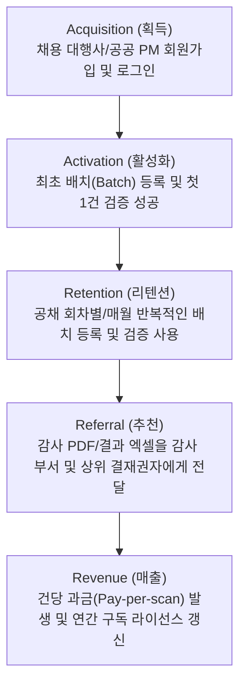

**Path:** [[index]] > [[_Growth_Verification_MOC]] > 현재문서

# Day 51: ARRR & 가설 수립 (Framework & Hypothesis)

## 📌 1. ARRR 깔때기 분석 (Funnel Mapping for HR BooleanAI)

B2B SaaS 기반의 **HR 서류 진위확인 솔루션**이 지속 가능하게 성장하기 위해, 사용자(채용 담당자 및 채용 대행사)의 획득부터 매출까지의 퍼널을 다음과 같이 정의합니다.



| 퍼널 단계 | 본 솔루션에서의 행동 정의 | 측정 핵심 메트릭 (KPI) |
| :--- | :--- | :--- |
| **Acquisition (획득)** | 인사담당자가 웹 대시보드에 접근하여 로그인 | 주간 활성 담당자 수 (WAU), 신규 가입 전환율 |
| **Activation (활성화)** | 첫 배치 생성 및 최소 1건 이상의 서류에 대한 RPA + AI 진위확인 파이프라인 작동 성공 | 배치 등록 성공률, 첫 검증 성공 소요 시간 |
| **Retention (리텐션)** | 신규 공채 기간이 돌아왔을 때 이탈하지 않고 다음 배치를 생성하여 진위확인을 재가동 | 코호트 리텐션 (1주/4주/3개월 주기 배치 재실행율) |
| **Referral (추천)** | 1클릭 결과 엑셀 다운로드, 감사원 제출용 증적 PDF 리포트 다운로드 및 유통 | 리포트 다운로드 횟수, 파트너 플랫폼(ATS) API 연동사 수 |
| **Revenue (매출)** | 무료 체험 쿼터(예: 100건) 소진 후 유료 전환 또는 건당 과금 결제 | 고객 획득 비용(CAC) 대비 고객 생애 가치(LTV) 비율 |

---

## 💡 2. 핵심 비즈니스 가설 수립 (Core Hypotheses)

솔루션의 핵심 가치 제안(Value Proposition)인 **시간 단축, 감사 면책권 확보, 오류율 제로**를 검증하기 위해 다음과 같이 핵심 가설과 측정 지표를 수립합니다.

### 가설 1: AI 판독 추천 UI를 통한 의사결정 시간 단축
* **배경:** 기존 수기 검증 시에는 담당자가 직접 발급처 사이트에 접속하고 입력하여 결과를 육안으로 비교하느라 건당 평균 12분이 소요되었습니다.
* **가설:** AI Reviewer Agent가 원본 서류와 RPA 캡처본을 3중 교차 검증(Triple Check)하여 도출한 **판독 권고(APPROVE/REJECT/ESCALATE)와 자연어 근거 요약**을 대시보드 상에 제공하면, 담당자의 서류 판정 최종 의사결정 시간이 **80% 이상 단축**될 것이다.
* **성공 기준 및 지표:**
  * 서류당 최종 판정 클릭 소요 시간 (평균 p95 ≤ 30초)
  * AI 판정 결과 대비 담당자가 결정을 뒤집은 비율(AI Override Rate) ≤ 5%

### 가설 2: Self-Service 소명/재제출 루프를 통한 민원 및 개입 차단
* **배경:** 서류 불일치 혹은 누락 발생 시, 담당자가 지원자에게 일일이 유선이나 개별 메일로 연락하여 보완을 요청하는 과정에서 민원과 수동 업무 병목이 발생합니다.
* **가설:** 검증 결과 반려(`REJECT`) 판정 시, 구체적인 불일치 사유와 보완 서류 안내가 담긴 알림 메일(Resend API) 및 72시간 유효한 재제출 링크를 제공하는 Self-Service 루프를 가동하면, **담당자의 수동 개입 전화 건수가 90% 이상 감소**할 것이다.
* **성공 기준 및 지표:**
  * Self-Service 재제출 링크를 통한 보완 완료율 ≥ 85%
  * 회차별 담당자 수동 개입률 ≤ 10%

### 가설 3: 비개발자 PM의 기관 설정 hot-load 완결성
* **배경:** 새로운 사이트가 추가되거나 기존 사이트의 HTML 구조가 바뀔 때마다 개발자가 스크립트를 수정하고 배포하는 프로세스는 대응 지연을 초래합니다.
* **가설:** `config/agency_config.json` hot-load 엔진과 UI 상의 셀렉터 자동 추천 기능을 제공하면, 비개발자 PM이 **개발 지원 없이 3분 이내에 신규 진위확인 사이트 설정을 완료하고 RPA 구동 테스트까지 성공**할 수 있을 것이다.
* **성공 기준 및 지표:**
  * 신규 기관 설정부터 테스트 완료까지 걸린 시간 (평균 ≤ 3분)
  * AI 기반 CSS 셀렉터 추천 성공률 ≥ 70%

---

## 🛠️ 3. 실험 설계 및 GA4 이벤트 수집 전략 (Day 55 연계)

수립한 가설을 통계적으로 검증하기 위해 제품 내 사용자 행동을 추적할 수 있도록 GA4 커스텀 이벤트를 아래와 같이 정의하여 연동합니다.

```
┌───────────────────────┐
│     사용자 행동       │
└──────────┬────────────┘
           │
           ▼ [Event: batch_create]
┌───────────────────────┐
│      배치 등록        │
└──────────┬────────────┘
           │
           ▼ [Event: scan_start]
┌───────────────────────┐
│   진위확인 검증 실행  │
└──────────┬────────────┘
           │
           ▼ [Event: decision_confirm]
┌───────────────────────┐
│ AI 권고 최종 승인/반려│
└──────────┬────────────┘
           │
           ▼ [Event: excel_export / pdf_export]
┌───────────────────────┐
│   결과 보고서 다운로드│
└───────────────────────┘
```

1. **`batch_create`**: 획득 및 활성화(Activation) 측정. (파라미터: `batch_id`, `applicants_count`)
2. **`scan_start`**: 핵심 기능 사용성 측정. (파라미터: `batch_id`, `doc_types`)
3. **`decision_confirm`**: 가설 1(AI 판독) 및 가설 2(Self-Service) 측정. (파라미터: `doc_id`, `original_ai_decision`, `final_user_decision`, `is_overridden`, `decision_duration_ms`)
4. **`excel_export` / `pdf_export`**: 추천(Referral) 및 유통 가치 측정. (파라미터: `batch_id`, `user_role`)
5. **`agency_config_save`**: 가설 3(PM 자가 설정) 측정. (파라미터: `agency_id`, `is_ai_recommended`, `is_test_success`)

---
**관련 노드 탐색 (Related Nodes):**
- 연관 개념: [[Triple_Check_Loop]], [[Self_Service_Fallback]], [[Audit_Trail]]
- 이전 기획 자료: [[source_10_jtbd_interview]], [[source_5_problem_definition]]
- 다음 단계 진도: [[_Growth_Verification_MOC]], [[Day52_NSM_and_Experiment_Design]]
